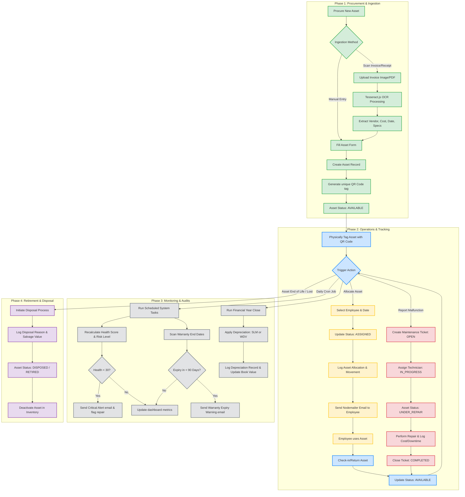
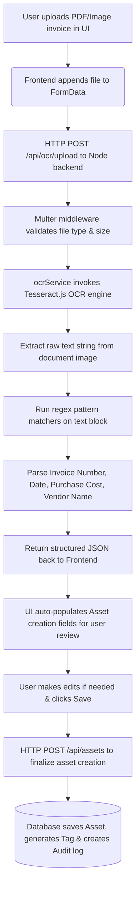
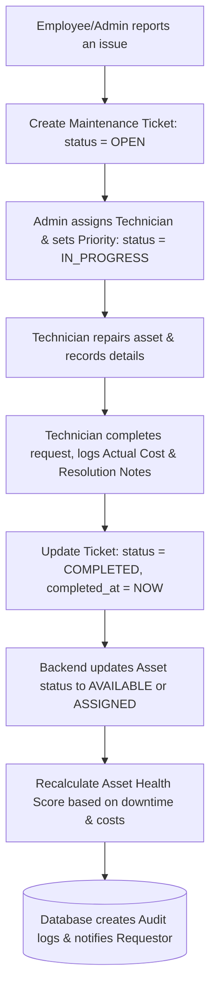

# Project Workflow Diagram & Description

This document details the exact runtime workflows, sequence paths, and logic flows governing the **AI-Powered Smart Asset Management System**.

---

## 0. Master Asset Lifecycle Flowchart

The following flowchart outlines the complete lifecycle of a managed asset—from procurement and OCR ingestion to operational tracking, maintenance, auditing, and retirement.



---


## 1. User Authentication & Session Refresh Workflow

Ensures stateless, secure API communication while maintaining a seamless user experience.

```mermaid
sequenceDiagram
    autonumber
    actor User as Client Browser
    participant Store as Zustand Auth Store
    participant API as Axios Client Interceptor
    participant Backend as Express API
    database DB as MySQL DB

    User->>Store: Enter credentials & click Login
    Store->>Backend: HTTP POST /api/auth/login
    Backend->>DB: Query User & verify bcrypt password hash
    DB-->>Backend: User credentials valid
    Backend-->>Store: Response 200 (Access Token, Refresh Token, User Metadata)
    Store->>Store: Save tokens in LocalStorage via Persist Middleware
    Store-->>User: Redirect to Dashboard Page

    Note over User, Backend: -- Submitting an Authenticated Request --
    User->>API: Click "View Assets" page
    API->>API: Read Access Token from Zustand store
    API->>Backend: HTTP GET /api/assets (with Bearer Token header)
    
    alt Access Token is Valid
        Backend->>Backend: Validate JWT signature & check RBAC claims
        Backend-->>User: Return Assets List (JSON)
    else Access Token is Expired
        Backend-->>API: Response 401 Unauthorized (Token Expired)
        API->>Backend: HTTP POST /api/auth/refresh (with Refresh Token)
        Backend->>DB: Validate Refresh Token matches active DB record
        DB-->>Backend: Refresh Token is valid
        Backend-->>API: Return new Access Token & rotating Refresh Token
        API->>API: Update Zustand Store with new tokens
        API->>Backend: Retry original HTTP GET /api/assets (with new Bearer Token)
        Backend-->>User: Return Assets List (JSON)
    end
```

### Steps Description:
1. **Initial Login**: User posts credentials. The server verifies the password against the bcrypt hash in the database.
2. **Token Issuance**: The server generates a short-lived Access Token (15 mins) and a long-lived Refresh Token (7 days) and returns them alongside user details.
3. **Session Interceptor**: The Axios client automatically injects the Access Token into the HTTP headers for all requests.
4. **Auth Expiry & Refresh**: If a request fails with a `401 Unauthorized` status (due to token expiration), the client silently requests a token refresh. If valid, the new token is saved, and the original request retries transparently without interrupting the user.

---

## 2. Smart OCR Invoice Asset Ingestion Workflow

Simplifies asset creation by extracting technical details and purchase dates from scanned documents.



### Steps Description:
1. **Upload Invoice**: An administrator uploads a digital receipt or scanned invoice.
2. **Text Extraction**: The backend processes the document locally using Tesseract OCR, converting images to text.
3. **Regex Extraction**: Custom parsing patterns search for currency symbols, monetary values, date formats (e.g. DD/MM/YYYY), invoice identifiers, and vendor names.
4. **Pre-fill Review**: The parsed data maps directly into the asset creation form, allowing the operator to verify accuracy and click save.

---

## 3. Asset Allocation (Check-Out & Check-In) Workflow

Governs how physical assets are tracked when assigned to personnel.

```mermaid
sequenceDiagram
    autonumber
    actor Admin as Admin / HR User
    participant System as Express Backend
    database DB as MySQL DB
    participant Mail as Email Transporter

    Admin->>System: Submit Allocation Form (Asset ID, Employee ID, Expected Return Date)
    System->>DB: Check if Asset status is 'AVAILABLE'
    alt Asset is not AVAILABLE
        DB-->>System: Return Asset is Checked Out / In Repair
        System-->>Admin: Return 400 Bad Request
    else Asset is AVAILABLE
        System->>DB: Create 'asset_allocations' record (status = 'ACTIVE')
        System->>DB: Update 'assets' table: status = 'ASSIGNED', assigned_to = Employee_ID
        System->>DB: Insert 'asset_movements' record (movement_type = 'ALLOCATION')
        System->>DB: Insert 'audit_logs' record (action = 'ALLOCATE_ASSET')
        System->>Mail: Queue assignment email to Employee
        Mail-->>System: Email Sent successfully
        System-->>Admin: Return Allocation Success Response
    end
```

### Steps Description:
1. **Allocation Check**: Before checked out, the asset status is validated to ensure it is not already assigned, lost, or in repair.
2. **Database Updates**: A transaction updates the asset status, associates it with the employee, adds a historical track to `asset_movements`, and logs the action in the `audit_logs` table.
3. **Notification**: The system generates in-app notifications and uses Nodemailer to send a checkout confirmation receipt to the employee's inbox.
4. **Return Workflow**: When the asset is checked back in, the status is reverted to `AVAILABLE`, the allocation record is set to `RETURNED`, a return movement is logged, and any warranty or health metrics are updated.

---

## 4. Maintenance Lifecycle Workflow

Tracks asset performance issues and repair costs.



---

## 5. Automated System Tasks (Cron Workflows)

Scheduled tasks running automatically via `node-cron` inside `backend-node/src/scheduler.js`:

### A. Asset Health Score Calculations
* **Trigger**: Scheduled daily at 1:00 AM.
* **Operations**:
  1. Reads all active assets.
  2. Queries total maintenance occurrences, downtime hours, repair costs, and asset age.
  3. Computes health score from `0` to `100`.
  4. Categorizes risk levels (`LOW`, `MEDIUM`, `HIGH`).
  5. Triggers in-app alerts and notifications to the IT department for any asset in `CRITICAL` or `POOR` condition.

### B. Warranty Expiry Warnings
* **Trigger**: Scheduled daily at 2:00 AM.
* **Operations**:
  1. Computes remaining days until warranty expiration date.
  2. If matching warning intervals (90, 60, 30, 15, or 7 days remaining), flags corresponding reminder values.
  3. Sends warning notifications to administrators to arrange renewals or AMC upgrades.

### C. Depreciation Recalculation Runs
* **Trigger**: Executed on fiscal close schedules or requested manually.
* **Operations**:
  1. Analyzes asset category rules (useful life expectancy, rate, and calculation formulas: Straight Line vs. Written Down Value).
  2. Applies depreciation formulas.
  3. Records closing value to the asset record and appends a row to `depreciation_records`.
